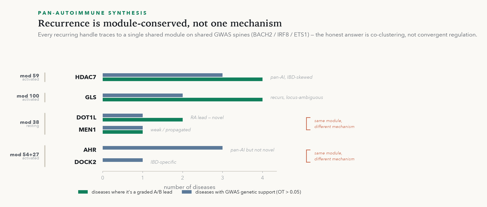
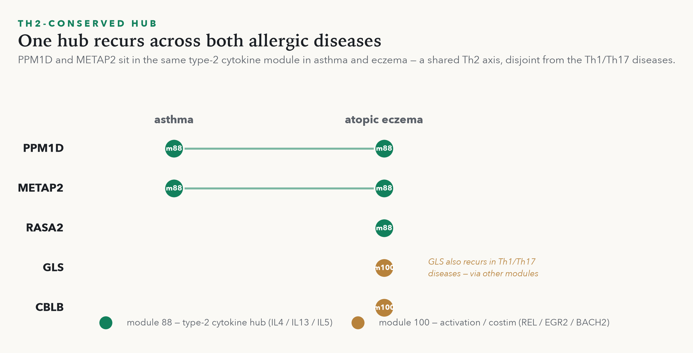
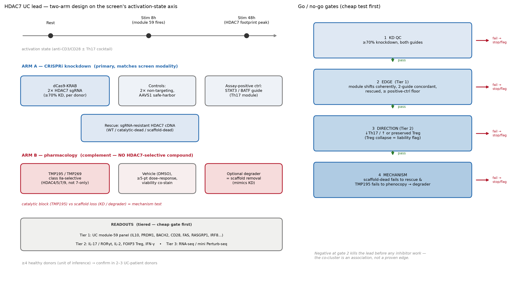
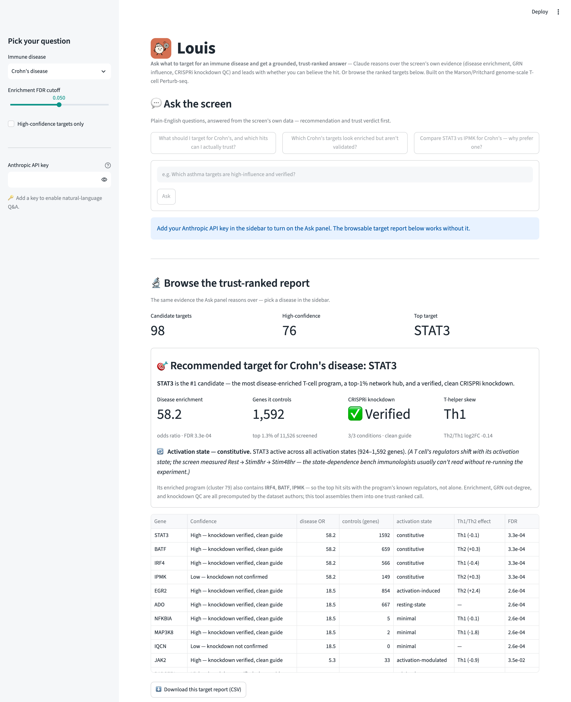

<p align="center">
  
</p>

# 🔎 Louis

*A CD4+ T-cell target detective — named for Louis Pasteur (pronounced "Louie"; like Claude, a French name): **nothing trusted until it's verified.** Grounded in the Marson/Pritchard genome-scale CD4+ T-cell Perturb-seq screen.*

**Ask Louis to discover novel, druggable CD4+ T-cell drug targets for an autoimmune disease — grounded in a real CRISPR screen, validated against the scientific web AND the field's live community signal, and remembered in a shared lab knowledge base.**

An **MCP server**: no separate app, no API key, no metered credits. You talk to Claude the way you already do; this server grounds every answer in the **Marson/Pritchard genome-scale CD4+ T-cell Perturb-seq** (Zhu, Dann, …, Pritchard, Marson 2025; [preprint](https://www.biorxiv.org/content/10.64898/2025.12.23.696273v1) · [CZI Virtual Cells Platform](https://virtualcellmodels.cziscience.com/dataset/genome-scale-tcell-perturb-seq)) — disease enrichment, gene-network influence, CRISPRi knockdown QC, and activation-state dependence.

*Built for the Built with Claude: Life Sciences hackathon (Builder track).*

---

## The problem (a real one)

That screen perturbed **every gene in primary human CD4+ T cells** and mapped which regulators drive which programs, and which programs are enriched in autoimmune-disease genetics — i.e. **candidate drug targets**. But the hardest thing in biology isn't the analysis; it's getting a bench scientist to actually *use* a dataset like this. It lives behind AnnData objects and a bioinformatician. A wet-lab immunologist who just wants *"what should I target for Crohn's, and can I trust it?"* can't self-serve it — and won't touch a new website to try.

So don't make one. **Meet them where they already are: inside Claude.**

## What it does

Add the server to Claude, then just ask. It does four things — **discover, validate, listen, remember** — grounded in the screen and trust-verdict first.

**Discover** — not the obvious target, the novel one:
> **You:** *For rheumatoid arthritis, skip the obvious targets — find understudied, druggable handles wired to the disease's own risk genes.*
>
> **Claude** *(via the MCP)*: **DOT1L** — an epigenetic enzyme (pinometostat is in the clinic) — controls a module carrying the RA risk genes **IL21R** and **PTGER4** in *resting* T cells, knockdown verified clean. **GLS** (glutaminase) sits over a **PTPN22 / TRAF1** module in *activated* cells. Mechanistic, testable leads — and the regulator→risk-gene links exist in **no external database**, only in this screen.

**Validate** — hand the leads to Claude Science's scientific web (Open Targets, ChEMBL, PubMed, GWAS Catalog). In our run it ranked **DOT1L** the top novel + druggable RA lead, *caught* that the Open Targets scores were ontology-propagation artifacts (not real RA evidence), and independently confirmed the regulator→risk-gene links live only in the Perturb-seq.

**Listen** — take the engine's own discoveries (every handle + risk gene) and search **X/Twitter** for each, in an immune context: what labs, journals, and news desks are saying *this week*, before it's a paper. Wellness noise is vetoed; gene symbols self-filter (nobody but immunologists tweets "PTPN22"). Our data flagged **DOT1L**, a methyltransferase, for RA — and the listen layer independently surfaced **@ACR_Journals** the same week on **DNMT3A**, *another* methyltransferase in autoreactive CD4+ T cells reducing RA joint inflammation. Convergent, current, and surfaced from the field's live chatter — not a literature search. This runs live where X access exists, and is **baked into the KB** so it ships everywhere.

**Remember** — the knowledge base files the whole chain with provenance *and confidence level*; `kb_recall(DOT1L)` returns discovery + novelty + validation + community signal + verdict in one shareable profile, so it's never re-derived.

> **See it converge:** [a visual target dossier for DOT1L](docs/dot1l-dossier.html) — six sources ranked by confidence, and the two (X/Twitter + a conference abstract) that sit off Claude Science's allowlist.

Underneath it all, the **trust flag** — the difference between a hit worth bench time and one that wastes it:
> **You:** *For Crohn's, what should I target, and which can I trust?*
>
> **Claude**: **STAT3** — verified clean knockdown, top-1% network hub. ⚠️ **IPMK** sits in the *same* program with the *identical* enrichment, but its knockdown was never confirmed — enrichment alone would rank it a co-top hit; don't spend bench time on it.

The tools (all grounded, no LLM guessing):

| Tool | Returns |
|---|---|
| `disease_mechanisms` | **discovery** — druggable handles wired to a disease's risk-gene modules, per activation state |
| `disease_targets` | ranked candidates + OR, GRN influence, **trust flag**, activation state, Th1/Th2 |
| `target_evidence` | the full "why this target" case for one gene |
| `regulator_detail` · `state_profile` | per-condition GRN + CRISPRi QC · activation-state trajectory |
| `community_signal` | **listen** — recent X/Twitter chatter (labs/journals first) about a gene or disease, pre-paper |
| `kb_recall` · `kb_remember` · `kb_remember_signal` · `kb_verdict` | the **knowledge base** — recall before deriving, file findings + community signal with provenance, record verdicts |
| `list_diseases` | the 17 autoimmune diseases in the screen |

## Quick start

```bash
git clone https://github.com/rpinho/louis && cd louis
python3 -m venv .venv && source .venv/bin/activate
pip install -e .                      # core engine + MCP server
python scripts/download_data.py       # small public tables (~34 MB), MIT
```

**Claude Code** — the repo ships a `.mcp.json`, so just open the project and approve the `louis` server (or `claude mcp add louis -- .venv/bin/louis-mcp`). Then ask your question.

**Claude Desktop** — add to `claude_desktop_config.json` (the editable install makes the command location-independent):

```json
{
  "mcpServers": {
    "louis": {
      "command": "/ABSOLUTE/PATH/louis/.venv/bin/louis-mcp"
    }
  }
}
```

Restart Claude, and ask: *"Using louis, what should I target for rheumatoid arthritis, and which are verified?"*

Sanity-check the engine + server without Claude:

```bash
python -m louis.core     # prints top targets, asserts the Crohn's→STAT3 demo invariant
```

## What makes it more than a lookup

Four things, none of which a literature search can give you — because they live in the assay and in the screen's network structure, not the papers:

- **Mechanistic discovery.** The screen's gene-regulatory clusters carry *both* their regulators and their downstream genes, so `disease_mechanisms` wires a druggable **handle** to the disease's own risk-gene **module**, in a specific state — "perturb DOT1L to move the RA IL21R/PTGER4 program in resting cells." That's a testable hypothesis, and the edge exists in no external database. (Module-level co-cluster — a candidate controller to *test*, not a proven gene-level edge; those need the full `.h5ad`.)
- **Trust flag.** From the screen's own QC — was the CRISPRi **knockdown verified on-target**, and is the guide **off-target**? This is what stops you spending months on a hit that only *looks* good (see IPMK above).
- **Activation state.** A T cell's regulators shift with its state; the screen measured three (Rest / Stim8hr / Stim48hr) and ~87% of hub regulators change ≥2× across them. The server surfaces which state a target acts in — the state-dependence a bench immunologist otherwise needs a whole experiment to read. (The **three measured states**, not modeling unmeasured ones.)
- **A learning knowledge base.** `kb_recall / kb_remember / kb_verdict` maintain a git-tracked markdown KB (a target profile is a reputation record: data facts + literature novelty + validation + the scientist's verdict, each with provenance). Recall before deriving; file findings back so nothing is re-derived; hand the whole thing to a student.
- **The off-allowlist layer — social + conference.** `community_signal` turns the engine's own discoveries into search terms and reads what immunologists are *saying* about each lead — on **X** and on the **conference floor** (ACR/EULAR abstracts). This is the one layer Claude Science structurally can't reach: its sandbox is a strict domain **allowlist** (PubMed, bioRxiv, ChEMBL, Open Targets are on it — Twitter and conference-abstract sites are **not**). So the papers and preprints it already has; what it's missing is what the field is saying *around* them — before, beyond, and sometimes instead of publication. Curated (labs/journals first, wellness vetoed) and baked into the KB, so it ships even inside that sandbox.

## What it found — validated across 9 diseases

Louis's own skill was run *inside Claude Science* across **nine autoimmune diseases** — RA, SLE, Crohn's, MS, UC, psoriasis, type-1 diabetes, asthma, atopic eczema — each candidate pressure-tested against Open Targets / ChEMBL / GWAS Catalog / PubMed / ClinicalTrials, graded A–D, and written back to the KB. What came out:

- **Novel leads a database wouldn't hand you** — DOT1L (RA), HDAC7 (UC/MS), **DOCK2** (a Rac-GEF whose autoimmune-CD4 role Bluesky independently corroborated the *same week* — the Waggoner Lab's "TCR–SUB1–DOCK2 axis promotes autoimmunity"), **PPM1D** (asthma + eczema, with a tool inhibitor), **RASA2** (eczema — best genetics of the set, honestly flagged as undruggable today).
- **It refuses to overclaim.** Asked whether the recurring "epigenetic axis" (DOT1L/HDAC7/MEN1) is one pan-autoimmune *mechanism*, Louis says **no** — the recurrence is *module-conservation* on shared GWAS hubs (ETS1/IRF8/BACH2/CD28/PTPN22…), not convergent regulation. Refusing the flashy overclaim is the credible answer.
- **Two disjoint conserved axes.** The Th1/Th17 diseases share one module-set; the Th2/allergic diseases (asthma + eczema) share a *different* one — a PPM1D/METAP2 type-2-cytokine hub — with metabolic GLS the only cross-over.

<p align="center">
  
  &nbsp;
  
</p>

And it designs the bench experiment. Ask Louis to *test* a lead and it returns a real two-arm protocol — CRISPRi knockdown + a selective inhibitor, sgRNA-resistant/catalytic-dead rescue controls, a mandatory direction-of-effect gate — on the screen's own activation-state axis:

<p align="center">
  
</p>

## Optional: local visual browser

A Streamlit UI (disease dropdown → ranked table → evidence panel → per-state chart → CSV) is included for a visual, click-through view of the same data:

```bash
pip install -e ".[app]" && streamlit run app.py   # → http://localhost:8501
```



## Optional: share it with your lab on Slack

A **Slack bot** (Socket Mode — no hosting, no public URL) puts the same engine where a lab already talks. `@target-explorer what should we hit for RA?` or `/ask-target rheumatoid arthritis` returns trust-ranked leads + the community signal **in a public channel** (knowledge is shared, not siloed in DMs), and `/remember` files findings to the **shared** KB so the whole team's questions compound into one memory. Setup (~3 min) and the paste-to-create app manifest are in [`slack/SETUP.md`](slack/SETUP.md).

```bash
pip install -e ".[slack]" && python -m louis.slack_app
```

## Data

Uses the authors' **precomputed** supplementary tables (auto-downloaded): cluster↔disease enrichment, per-perturbation DE stats (with `n_downstream` = GRN out-degree, per `culture_condition`), guide knockdown efficiency, sgRNA off-target library, Th1/Th2 signature. The full ~22M-cell AnnData is **not** required. Those tables are distributed by the study authors under the MIT License via their public analysis repo; this project re-uses them and does not redistribute the underlying single-cell data.

## Scope / honesty

17 autoimmune diseases, 185 significant disease↔program links. This surfaces and *trust-ranks* candidate targets from a published dataset — hypothesis generation and prioritization for a bench scientist, **not** a validated clinical claim. Confidence flags reflect experimental QC of the CRISPRi perturbation, not therapeutic efficacy.

*License: [MIT](LICENSE). New code written for the hackathon; public dataset.*
