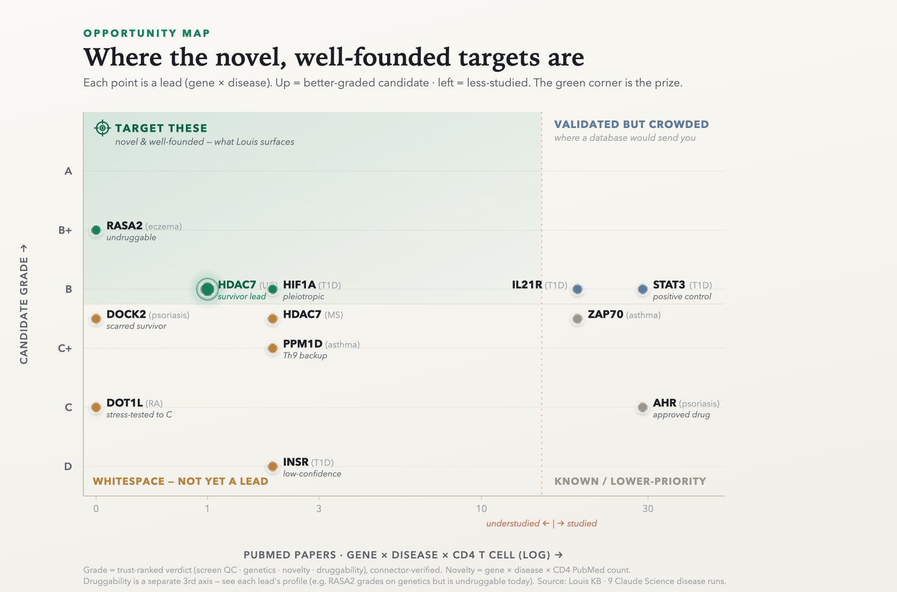

# Submission packet — Louis

The ~190-word summary, the 3-minute demo script, and the judging-criteria map.
Numbers are produced live (`python -m louis.core` re-checks the discovery
+ demo invariants on every run; `python scripts/build_kb_index.py` reports KB size).

---

## Submission summary (~200 words)

**Louis** is an **MCP server + Slack bot** that turns a genome-scale CD4⁺ T-cell CRISPRi
Perturb-seq screen (Zhu, Dann, …, Pritchard, Marson 2025) into a discovery, validation, and
memory assistant that lives *inside Claude* — no separate app, no API key. Named for Pasteur,
Louis does five things:
**DISCOVER** — it wires understudied, druggable regulator "handles" to a disease's own GWAS
risk-gene modules, gated by CRISPRi knockdown QC (the **trust flag**) and tagged by activation
state (a **blind positive control**: the same ranking re-derives the known Th17 masters
STAT3/BATF/IRF4 as its top-3); **VALIDATE** — it hands each lead to Claude Science's scientific web (Open Targets, ChEMBL,
PubMed, GWAS Catalog, ClinicalTrials) to grade novelty and druggability; **LISTEN** — it reads
what immunologists are posting on **X, Bluesky, and conference floors** *this week*, before it's a
paper; **REMEMBER** — it files the whole chain, with provenance *and confidence level*, to a shared
knowledge base the **whole lab writes to** (a labmate corrects Louis in Slack and he files it,
attributed); **SYNTHESIZE** — it recurs handles across diseases to separate a single mechanism from
shared disease-wiring. For RA it surfaces **DOT1L** — novel, druggable (pinometostat), its
regulator→risk-gene link in **no external database** — corroborated by same-week preprint +
conference signal Claude Science structurally *cannot* reach. Every claim traces to a source —
built with Claude, shared with the whole lab.

---

## The one-liner spine (what makes it win)

Louis doesn't just find a novel target — it **tells a genuine bleeding-edge bet from hype**, and
proves it: for the same panel of leads it graded **DOT1L a real pre-paper edge** (mechanism lives
only in a preprint + a conference abstract) while **killing MEN1 (menin buzz is all oncology),
GLS (signal is synoviocytes, wrong cell), and CBLB/RIPK1 (edge already closed/published).**
Separating edge from noise *is* the product.

The **opportunity map** makes that spine visual — candidate **grade** (y) against **novelty** (x),
each point a connector-graded verdict:

  

The green corner — high-grade **and** understudied — is the whole product: DOT1L, HDAC7, PPM1D, RASA2,
HIF1A. The known genes (IL21R, STAT3, ZAP70, AHR) sit right, *validated but crowded*; DOCK2 is genuine
whitespace still maturing; INSR is the screen grading its own artifact a D. And the honesty is in what's
*absent* — MEN1 and GLS aren't plotted, because their story is misattributed buzz and cross-disease grade
drift, not a clean grade × novelty point; the two-axis map refuses to flatten them into false leads.

---

## 3-minute demo script (beat by beat)

> The whole demo is a conversation with **Louis**, in Slack and in Claude. Discover, listen,
> remember run through the Louis MCP/skill; validate + experiment-design run in Claude Science;
> the Slack coda shows where a lab actually talks. All Anthropic, all on the subscription — no
> third-party app, no API key. Every answer is TL;DR-first and scannable (it's a video). Screen-record it.

### Beat 1 — the real problem (0:00–0:25)
- **[SAY]** "This is a genome-scale CRISPR screen of human T cells — a map of autoimmune drug
  targets. The hardest thing in biology isn't the analysis; it's getting a bench scientist to
  *use* a dataset like this. So we didn't build a website. We put it inside Claude — and named it
  Louis, after Pasteur (and, like Claude, a French name). It discovers, it doesn't just look up."

### Beat 2 — DISCOVER + TRUST (0:25–1:05)
- **[SCREEN]** In Slack: *`@louis for rheumatoid arthritis, skip the obvious targets — novel
  druggable handles wired to the risk genes, and which can I trust?`*
- **[SAY]** "It doesn't hand me STAT3. It wires **DOT1L** — an epigenetic enzyme, pinometostat in
  the clinic — to a module carrying the RA risk genes **IL21R** and **PTGER4** in *resting* T cells,
  knockdown verified clean. And it leads with the **trust flag**: a high-enrichment hit whose
  knockdown was never confirmed is a *caution*, not a recommendation. The regulator→risk-gene link
  exists in **no external database** — only in this screen."

### Beat 3 — LISTEN: who else, and is it real? (1:05–1:55) ← the moat + the honesty
- **[SCREEN]** *`@louis who else is working on DOT1L — and is the buzz real edge or hype?`*
- **[SAY]** "Claude Science reads *published papers* — but its sandbox is a strict allowlist; it
  literally cannot reach Twitter, Bluesky, or a conference site. That's our moat. Louis grades
  **DOT1L a genuine pre-paper edge**: the Treg-identity/DNA-demethylation mechanism that supports
  it exists *only* as a bioRxiv preprint and an **ACR conference abstract** — off the allowlist.
  And in the same breath it **rejects the hype**: the menin-inhibitor buzz around **MEN1** is all
  leukemia, orthogonal; the **GLS** signal is synoviocytes, wrong cell type. Five sources converge
  on DOT1L, and two of them Science *cannot see*. That's the friend who says: chase it — and here's
  who's presenting it."

### Beat 4 — EVALUATE: design the experiment (1:55–2:30)
- **[SCREEN]** *`@louis is DOT1L a good bet — design the cleanest experiment.`* (Louis + Claude Science)
- **[SAY]** "It returns a real two-arm protocol on the screen's own activation-state axis: CRISPRi
  knockdown as the primary arm, pinometostat as the pharmacology complement, an **sgRNA-resistant +
  catalytic-dead rescue** for specificity, **H3K79me2 CUT&RUN** target-engagement at IL21R, a
  **mandatory Treg readout** because DOT1L supports Treg identity — and cheap-gate-first go/no-go
  gates so a negative result kills the lead before any inhibitor work. *(We ran the same for the UC
  lead, HDAC7 — full protocol shipped in the repo.)*"

### Beat 5 — REMEMBER, and the trust chain (2:30–2:55)
- **[SCREEN]** *`@louis remember DOT1L`* → then `kb_recall(DOT1L)` — one profile: discovery + novelty
  + validation + community signal + verdict + experiment, each cited. Then flip **`--nomem`**.
- **[SAY]** "It files the whole chain to a shareable KB — recall it and it's there, no re-derivation.
  Watch the trust go all the way down: Claude Science's *own* reviewer flagged a citation it couldn't
  confirm; an independent check confirmed the paper is real — but a *preprint*, a precision even the
  validator missed. And the contrast: ask the same question with **memory off** and you get a generic
  answer; with memory on, the whole compounded case. Every claim traces to a source **and its
  confidence level**."

### Beat 6 — the lab makes Louis smarter (2:55–3:25) ← the closer
- **[SCREEN]** Slack, public channel. A labmate replies to Louis: *"@louis we tested DOT1L — the
  module edge didn't hold, that verdict's too strong."* Louis: *"✍️ Filed to DOT1L — downgraded,
  attributed to @jordan."* Ask again → the answer now carries the lab's result. Then flip `--nolab`
  → the answer *before* the lab weighed in.
- **[SAY]** "And he doesn't just answer — he *learns from the lab*. A bench result, a 'that's weaker
  than you think', a 'John's already on that' — anyone can correct Louis in the channel and he files
  it to the shared memory, **with their name on it**. `--nolab` shows what he knew before the lab
  weighed in; the difference *is* the lab's own compounding knowledge. Discover, validate, listen,
  remember, synthesize — and now learn, together. That's Louis: a very smart lab assistant that never
  forgets and gets smarter every time the lab talks to it. Built with Claude — a French name, like
  Louis — living inside it, and shared with your whole lab."

---

## How it maps to the judging criteria

- **Demo (30%)** — a live, five-move conversation (discover → validate → listen → remember →
  synthesize) with a novel hero (DOT1L, not STAT3), a memorable spine (**edge vs hype**: it
  corroborates DOT1L *and* rejects MEN1/GLS in the same answer), a real bench experiment, and a
  Slack coda — every claim traced to a source *and* its confidence level.
- **Impact (25%)** — attacks the bottleneck a bench scientist named as *the hardest thing*: adoption,
  not analysis. It hands a wet-lab that can't afford a bioinformatician a novel, druggable, testable
  lead (Claude Science independently confirmed the regulator→risk-gene edge exists in no external
  database) plus the experiment to test it, and a Slack bot spreads it to the whole lab (public
  channels, so knowledge compounds instead of siloing).
- **Claude use (25%)** — it *is* an MCP (the host reasons on the subscription, no API cost); it
  *composes with Claude Science's* connectors for validation; and its **listen** layer adds a data
  source even Science lacks — the field's pre-paper chatter on X/Bluesky/conference floors. The
  knowledge base was itself deepened by **recursion**: Louis's own skill run *inside* Claude Science
  across nine diseases, its findings ingested back with provenance. And because it's an MCP + a
  tool-using agent it's **open-ended** — add a tool (~20 lines) or point Claude at your lab's own MCP
  server (ELN / LIMS / your screens) and Louis reasons over your whole stack; the shared-memory writes
  were added exactly that way.
- **Depth (20%)** — a **blind positive control** grounds the method: told only a disease's GWAS risk
  genes and no known targets, the *same* unsupervised ranking re-derives the textbook Th17 master triad
  **STAT3 / BATF / IRF4** as its top-3 for the core inflammatory diseases (STAT3 #1 in 6 diseases;
  one-command repro, `scripts/positive_control.py`) — it recovers the known before it proposes the novel,
  which is what earns trust in DOT1L. On top of that: a real GRN + CRISPRi-QC trust layer, an
  activation-state axis, and a module→risk-gene discovery engine on the authors' tables; a community-signal
  engine that self-filters by gene symbol and vetoes wellness noise; a knowledge base in a mature PKM shape
  (routing, provenance, recall-before-derive, dimensional `kb_query`, cross-disease synthesis, and a
  grade × novelty opportunity map that prioritizes the whole portfolio at a glance). Honest resolution
  stated throughout: module-level co-cluster hypotheses to *test*, not proven gene-level edges; the
  positive control is a recovery sanity check, not a held-out predictive AUROC.

---

## How this was built with Claude (the recursion)

The seed KB was small. To deepen it, Louis's **own skill was uploaded into Claude Science** and run
across **nine autoimmune diseases** — RA, SLE, Crohn's, MS, UC, psoriasis, type-1 diabetes, asthma,
atopic eczema — each session validating the leads against Open Targets / ChEMBL / PubMed / GWAS Catalog /
ClinicalTrials, grading A–D, and writing findings back with per-source provenance. Those write-backs were
ingested into the repo KB (additive, deduped, corrections kept — several times catching Claude Science
stating a drug's phase *from memory* when its own ChEMBL lookup said otherwise, and re-verifying every
screen number against the engine). A cross-disease synthesis recipe was folded back into the skill; the
community moat (X / Bluesky / conference abstracts — off Science's allowlist) was harvested and baked in.

The result: **195 target profiles, ~1,070 provenance-stamped records**, nine connector-verified diseases,
new leads per disease (**DOCK2, HIF1A, PPM1D, RASA2** — DOCK2 independently corroborated the same week by
a Bluesky post from the Waggoner Lab), two full experiment designs, and a portfolio synthesis whose
punchline is *honesty*: the recurring handles are **module-conservation on shared GWAS hubs, not one
convergent mechanism** — with two disjoint conserved axes, Th1/Th17 and Th2. A hero lead (DOT1L) whose
pre-paper edge was confirmed by a system that went looking everywhere else first.
