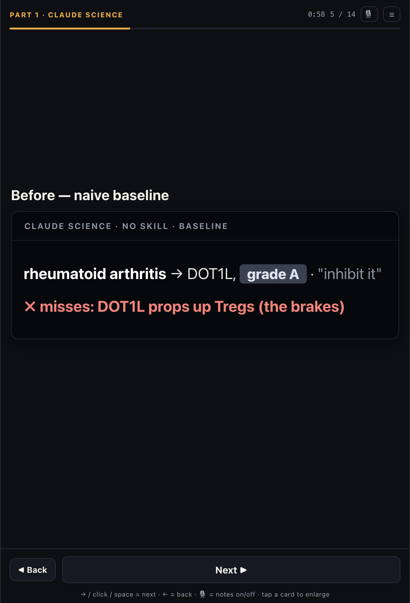
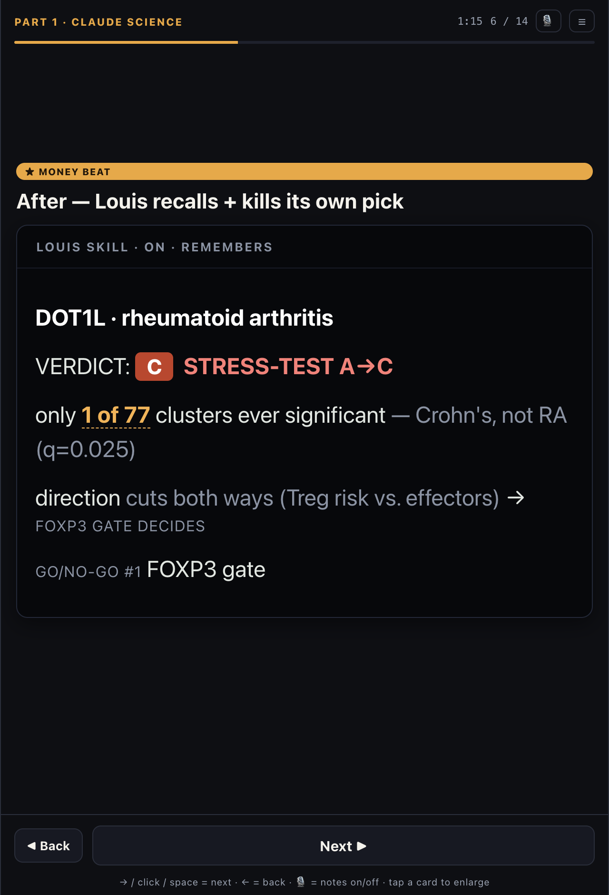
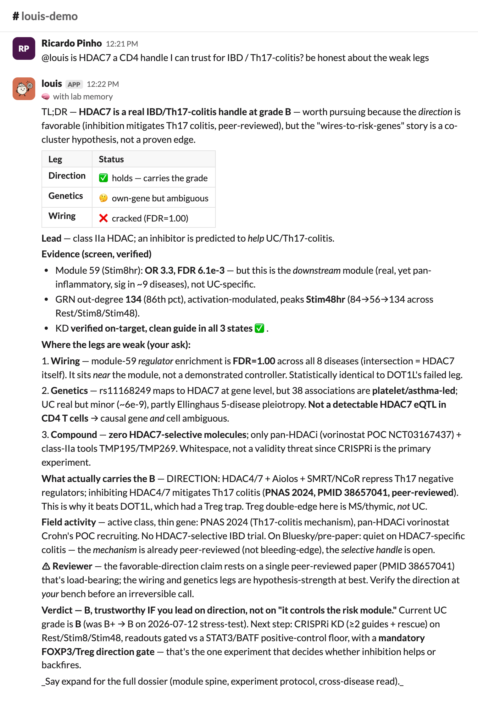
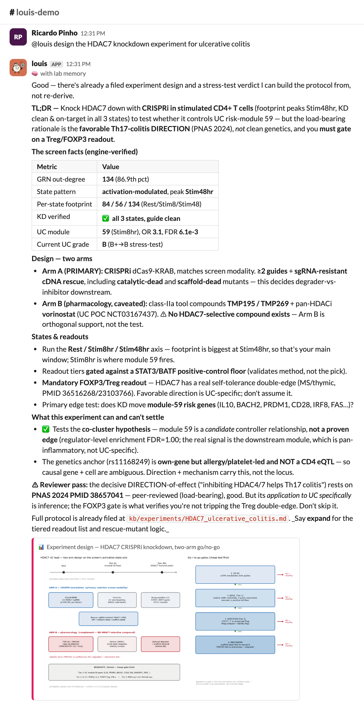
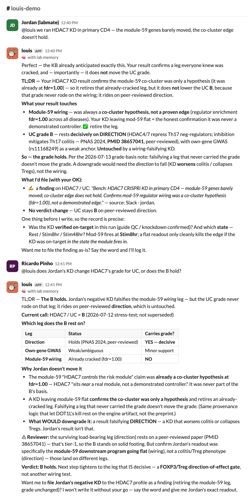
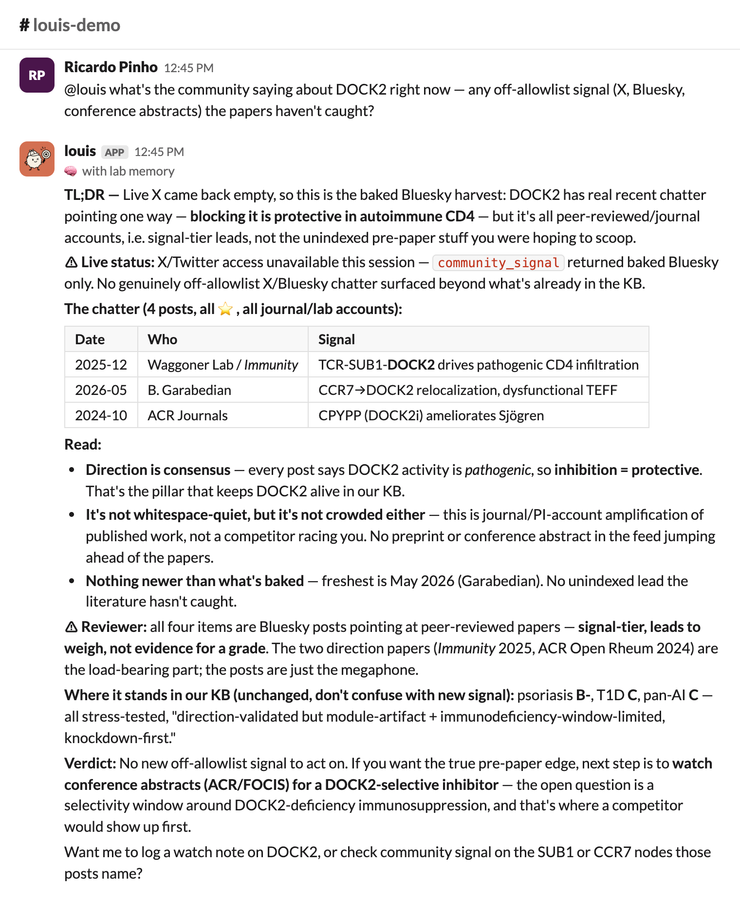

# Louis — the 3-minute demo (jury package)

> **Louis is a CD4⁺ T-cell drug-target discovery assistant that stress-tests its own
> flagship, learns from your lab, and reads the bleeding edge — built with Claude, and it
> meets you where you already work** (a skill in Claude Science, a plugin in Claude Desktop,
> an MCP server in Claude Code, a bot in Slack).

Data: the genome-scale CD4⁺ T-cell CRISPRi Perturb-seq screen — *Zhu, Dann … Pritchard & Marson, bioRxiv 2025*.
Repo: <https://github.com/rpinho/louis> · **Try it yourself → four install paths in [`CLAUDE.md`](../CLAUDE.md)** · open the [presenter deck](presenter.html) (15 click-through cards).

This folder is the demo **on paper**, so a judge can evaluate it without watching a recording:
the run-of-show, the **verbatim current-build bot outputs**, screenshots of the deck and the
Slack threads, and one-command instructions to reproduce every output yourself.

| | |
|---|---|
| [`presenter.html`](presenter.html) | The **actual slide deck** — open it (15 click-through cards). The screenshots below are just for GitHub's inline preview. |
| [`outputs/verbatim_outputs.md`](outputs/verbatim_outputs.md) | Every beat's answer, reproduced through the **exact Slack brain** (`louis.assistant.answer`). Invariant-locked — the load-bearing claims reproduce (see [`tests/`](../tests/test_demo_invariants.py)); exact wording/formatting varies run to run. |
| [`screenshots/deck_01…15.png`](screenshots/) | The presenter deck, one PNG per card. |
| [`screenshots/slack_1…6_*.png`](screenshots/) | The Slack threads (incl. the bleeding-edge signal), rendered from the verbatim outputs. |
| [`../CLAUDE.md`](../CLAUDE.md) | **Try it yourself** — four install paths (skill / plugin / MCP / bot) + every gotcha. |

---

## The thesis — why this is more than a wrapper

Four moves, all *in frame* in the same 3 minutes:

1. **Honesty you can watch (trust).** Handed its own flagship RA lead **DOT1L**, Louis **stress-tests it A→C** —
   the RA "wiring" is a cross-disease-union artifact (only **1 of 77** regulator clusters is ever
   significant), and the therapeutic *direction* is a genuine open question — DOT1L props up regulatory T
   cells (an inhibitor could *worsen* RA), but also sustains pathogenic effector programs (Scheer 2020), so
   it's a bench go/no-go, not a claim. The kill leads on the engine artifact, not the direction. Then it
   returns the **survivor** — **HDAC7** for Th17-driven colitis (favorable, *peer-reviewed* direction) — with
   the go/no-go experiment. A discovery tool that kills its own darling, with receipts, is the product.
2. **It learns.** Every finding is weighed by **provenance** (a preprint can't decide a grade), Louis
   **reviews itself**, and the **whole lab writes back** to one shared memory — so questions compound instead
   of restarting.
3. **It reads the bleeding edge.** Louis pulls the off-allowlist signal a database can't — what immunologists
   post on **X and Bluesky** and drop in **conference abstracts** — and *weighs* it: its reviewer tiers that
   chatter **signal-strength** (a lead to chase, never evidence for a grade). The weakest of the four, but
   genuinely new — no other tool reads *and* honestly tiers the pre-paper floor. (See the DOCK2 thread: Bluesky
   flagged the TCR–SUB1–DOCK2 axis, and Louis surfaces it *and* refuses to let it inflate a grade.)
4. **It meets you where you work — four ways.** One engine + one shared memory, exposed as a **skill**
   (Claude Science), a **plugin** (Claude Desktop), an **MCP server** (Claude Code), and a **bot** (Slack).
   Louis isn't another website you have to visit — and it's *trivial to try*: point your Claude at the repo and
   it reads [`CLAUDE.md`](../CLAUDE.md) and installs it for you.

> One of the scientists here said the best feeling is starting six months of analysis and going to **fold
> laundry** while Claude Science runs it. With Louis's memory, the second time you ask — **you don't even
> have time to fold the laundry.**

Official hackathon weights this is built against: **Impact 25 · Claude Use 25 · Depth & Execution 20 · Demo 30.**

---

## Run-of-show — 3:00, five prompts + one "before" flash

| # | Where | Beat | Deck |
|---|-------|------|------|
| — | Science | **Before:** naive Claude picks DOT1L, confident, misses the Treg direction | `deck_05` |
| 1 | Science | **After:** Louis skill on → DOT1L **A→C**, provenance tier + ⚠Reviewer; HDAC7 stays lit | `deck_06` ★ |
| 2 | Science | The memory *is* the trust — recursion + a calibration caption (1 of 77) | `deck_07` |
| 3 | Slack | HDAC7 — honest co-cluster, peer-reviewed direction, screen-unique legs | `deck_09` |
| 4 | Slack | ELI5, two sentences | `slack_4` |
| 5 | Slack | The lab teaches Louis → the lead survives → a Monday go/no-go | `deck_14` ✔ |

The differentiator card (**Louis meets you where you work**, `deck_13`) and two optional skeptic volleys
(`deck_10`–`deck_12`) sit in the deck for Q&A / the longer cut.

---

## Part 1 — Claude Science (0:00–1:30)

**Before (naive baseline).** Plain Claude Science, no Louis skill, confidently recommends **DOT1L +
pinometostat** for RA — it even renders a publication-quality selection figure — and never flags that
DOT1L also supports Tregs. *(Verified live in the local Claude Science app; see the honesty note below.)*



**After (Louis skill on) — ★ the money beat.** Same question, Louis skill loaded. It **overrules its own
grade-A and tiers its evidence**: the kill rests on an *engine-verified* artifact (DOT1L isn't in RA's own
regulator set, enrichment fdr 0.68; only 1 of 77 clusters clears significance), while the scary Treg
direction rests on a **bioRxiv preprint** that Louis's own **reviewer** flags hypothesis-strength — *a weak
source can't decide a grade.* And the same instrument keeps **HDAC7 lit at B**.



→ The **verbatim** current-build answer for this beat (pillar table, "1 of 77", provenance tier, ⚠Reviewer):
[`outputs/verbatim_outputs.md`](outputs/verbatim_outputs.md#science-beat-1--slack-live-prompt-1--dot1l-stress-test-recall).
Claude Science's *own* "**Reviewer · No issues found**" panel appears on the after-session — it sets up
Louis's own reviewer in Part 2.

---

## Part 2 — Slack (1:30–3:00)

Everything below is the **real current-build bot output**, rendered in Slack layout. Reproduce any of it in
30 seconds (see *Reproduce it yourself*).

**Beat 3 — HDAC7 discovery (honest, direction-led).** The one novel handle whose direction *favors* you
(inhibition mitigates Th17 colitis, PNAS 2024, peer-reviewed) — but Louis flags its own wiring unproven
(fdr=1.00 co-cluster) and won't call the genetics a UC anchor. It leads on **direction + the screen-unique
legs** (verified KD in all 3 states, activation footprint). The IL-17-blockade-worsened-Crohn's objection is
handled in a **dedicated skeptic thread** (deck slide 11 / the live `#louis-demo` IL-17 thread), where Louis
argues HDAC7 acts *upstream* on Th17 differentiation (like the IL-23 blockers that work in IBD) — and honestly
flags that sparing barrier-protective IL-17 is **untested**, so the go/no-go should add a gut-barrier IL-17
**safety** readout (a recommended gate, not yet a claim).



**Returns designs, not just text.** Ask it to design the experiment and it posts the **schematic figure card**
inline (via `files_upload_v2`):



**Beat 5 — the lab teaches Louis → it compounds (✔ ends on a win).** A labmate's bench result falsifies the
weak wiring leg. Louis files it **attributed to Jordan**, retires that leg — but reasons that HDAC7's B never
rode on it (the wiring was always fdr=1.00), so the **lead holds** on the peer-reviewed direction: *"the same
provenance logic that let DOT1L's kill rest on the engine artifact, not the preprint."* It **won't touch the
record without the scientist's OK** and asks the right controls first (was the KD on-target? which activation
state — module-59 fires at Stim8hr?), then points to the decisive next test (a FOXP3/Treg gate). That's the
collaborative-memory **write → read** loop — the lab teaches Louis, and the memory compounds, self-corrects,
and stays human-in-the-loop.



**The bleeding edge (3rd pillar) — reads the off-allowlist floor, and *tiers* it.** Ask what the field is
saying right now and Louis pulls the signal a database can't reach — **X, Bluesky, conference abstracts** —
then its **⚠Reviewer tiers it honestly**: *"all Bluesky posts pointing at peer-reviewed papers — signal-tier,
the megaphone not the evidence."* It reads the pre-paper floor **and** refuses to let chatter inflate a grade
(it even discloses when live X is down). The weakest of the four pillars, but genuinely new.



---

## Do this LIVE — the "Louis is on the case, and it's *fast*" moment

Two messages, ~25 seconds, showing speed + memory + honesty under fire:

1. **New message** in `#louis-demo`:
   > `@louis is DOT1L a good novel target for rheumatoid arthritis? recall first, be honest about trust.`

   Louis answers **instantly** — recalled from memory, no re-derivation (tool trace: a single `kb_recall`):
   **stress-tested A→C** — the RA wiring is a cross-disease artifact (only 1 of 77 clusters is significant),
   and the direction is an open bench question (Tregs vs. effector programs), not a settled win.
2. **Reply in that thread:**
   > `@louis but pinometostat's already in the clinic — why not just run it in RA?`

   It defends without folding: *"being in the clinic solves druggability, not the two things that sink
   DOT1L… you'd be dosing a Treg-disabling agent into a Treg-deficient disease."*

*(Optional visual wow:* `@louis design the HDAC7 knockdown experiment for ulcerative colitis` → returns the
experiment schematic **figure card**.*)* Both verbatim outputs are in
[`outputs/verbatim_outputs.md`](outputs/verbatim_outputs.md).

---

## The collaborative-memory **write → read** loop

They are the two halves of *one* loop that proves Louis **learns from the lab**. Same topic, so the learning
is visible: knowledge in → a better answer out.

- **WRITE** *(a labmate teaches Louis)* — `@louis we ran HDAC7 KD in primary CD4 — the module-59 genes
  barely moved, the co-cluster edge doesn't hold.` → Louis **files it, attributed**, and retracts the weak
  wiring leg (tool trace: `kb_recall`, `kb_remember`).
- **READ** *(watch it stick)* — `@louis is HDAC7 still our best UC lead?` → Louis's answer now reflects the
  retraction *but* holds HDAC7 at **B** on the peer-reviewed direction — it integrated what you taught it,
  and the lead didn't rest on the falsified leg.

See both verbatim in [`outputs/verbatim_outputs.md`](outputs/verbatim_outputs.md), rendered together in
`screenshots/slack_5_write_read_loop.png`.

---

## How to say it out loud

**Genes — casual, the way immunologists say them:** **HDAC7** = "H-dack seven" · **DOT1L** = "dot-one-L" ·
**FOXP3** = "fox-P-three" · **STAT3** = "stat-three" · **IL21R** = "I-L-twenty-one-R" · **PPM1D** = "P-P-M-one-D".

**Diseases — speak the full name** (abbreviations are for slides/typing), with three exceptions:

| Write it | Say it |
|---|---|
| **RA** | "rheumatoid arthritis" (roo-muh-toyd arth-RY-tis) |
| **UC** | "ulcerative colitis" (UL-sur-uh-tiv co-LY-tis) |
| **IBD** | "I-B-D" *or* "inflammatory bowel disease" — both fine |
| **MS** | "M-S" — fine as letters |
| **SLE** | just say **"lupus"** (LOO-pus) — never "S-L-E" |
| **T1D** | "type one diabetes" |
| Crohn's "krohnz" · psoriasis "so-RY-uh-sis" · asthma "AZ-muh" · Th17 "T-H seventeen" · Tregs "tee-regs" ||

---

## Demo guards (the biology must survive scrutiny)

- **DOT1L / RA = C** (stress-tested A→C). Lead the kill on the *engine artifact*; the Treg-worsens direction
  is a *preprint* — hypothesis-strength, flagged by the reviewer.
- **HDAC7 / UC = B.** Lead on the **peer-reviewed direction**, *not* clean genetics. Its wiring is fdr=1.00
  (a co-cluster hypothesis); its GWAS is allergy/platelet-led. Don't overclaim it "spares protective IL-17"
  (untested → add a gut-barrier IL-17 readout to the go/no-go).
- **"1 of 77 regulator clusters clears significance… Crohn's q=0.025"** — never the retired "6 of 1309."
- The positive control (STAT3/BATF/IRF4) **calibrates the method**; it does not license the novel picks.

---

## Reproduce it yourself (this is real, runnable code — not a mockup)

The bot brain that produced every output in `outputs/` is `louis/assistant.py`; the same engine backs the
MCP server and the Slack bot. To reproduce a beat:

```bash
pip install -e ".[slack]"
export ANTHROPIC_API_KEY=sk-ant-...          # the NL brain
python - <<'PY'
from louis import assistant
text, tools, _ = assistant.answer(
    "is DOT1L a good novel target for rheumatoid arthritis? recall first, be honest about trust.",
    use_memory=True)
print("tools:", [t[0] for t in tools]); print(text)
PY
```

You'll get the DOT1L stress-test verdict in `outputs/verbatim_outputs.md`, with a single `kb_recall` in the
trace (recalled, not re-derived). Slack setup + the exact permissions are in [`slack/SETUP.md`](../slack/SETUP.md).
The opportunity map (candidate grade × novelty; DOT1L sits at C, stress-tested off the board) regenerates with
`python scripts/opportunity_map.py`:


---

## Honesty notes (what's real vs. rendered, and what to refresh before recording)

- **The Slack renders** (`screenshots/slack_*`) are the **verbatim current-build outputs** in Slack layout —
  the response text is exactly what the bot returns; only the chrome is rendered, so they're consistent
  (all "stress-test", "1 of 77"). The live `#louis-demo` channel is real and populated, but its **core
  threads (12:18–12:31) predate the 13:07 bot restart** and still say "red-team" (+ one threaded skeptic
  follow-up where Louis asked "which gene?" instead of inferring HDAC7 from the thread). **Refresh those
  three threads before recording** by re-asking the prompts above; the newer skeptic threads already say
  "stress-test."
- **Claude Science** (Part 1) is verified live in the local app; the after-session as currently rendered
  still shows the retired **"6 of 1309"** — re-run it with the current skill, or let the Beat-2 caption
  ("1 of 77 clusters") carry the stat.
- **The deck** (`screenshots/deck_*`) is the actual `PRESENTER.html`, public/slides mode.
